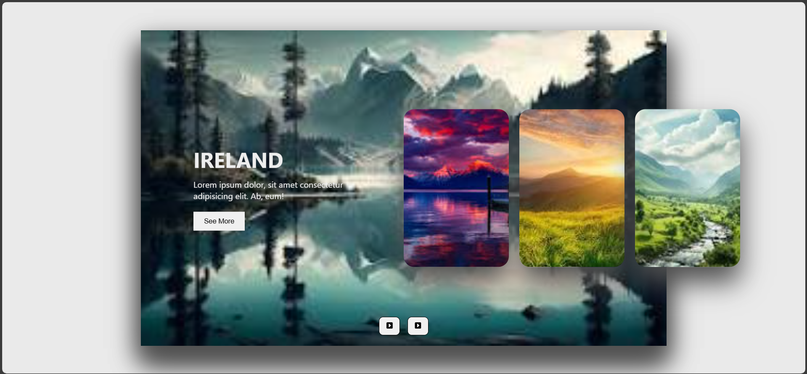

# Image Carousel Project

## Project Overview

This project implements a responsive image carousel using HTML, CSS, and JavaScript. The carousel allows users to navigate through a series of images with "Next" and "Previous" buttons. The images are styled to display descriptions and buttons that invite further interaction. The transition effects are smooth, enhancing the overall user experience.

## Features

- **Responsive Design**: The carousel adapts to various screen sizes and remains centred on the page.
- **Smooth Transitions**: The carousel items transition smoothly with fade-in effects and animations for a polished look.
- **Interactive Controls**: Users can navigate through the images using "Next" and "Previous" buttons.
- **Dynamic Content**: Each image has a title, description, and button that can be customized for different purposes.

## File Structure

- **`display.html`**: This file contains the HTML structure of the carousel. It includes the necessary containers, images, and buttons, as well as references to external CSS and JavaScript files.
- **`design.css`**: This CSS file handles the styling of the carousel, including layout, animations, and responsive design. It ensures the carousel looks visually appealing across different devices.
- **`control.js`**: The JavaScript file that adds interactivity to the carousel. It includes event listeners for the navigation buttons and handles the logic for transitioning between images.

## Usage

1. **Clone the Repository**: 
  

2. **Open the Project**:
   Open `display.html` in your preferred web browser.

3. **Customizing Content**:
   - **Images**: Replace the image URLs in `display.html` with your own images located in the `Images` directory.
   - **Text**: Modify the title and description for each item within the `display.html` file.
   - **Styles**: Adjust the styles in `design.css` to fit your design preferences.

4. **Navigation**:
   - Use the "Next" and "Previous" buttons to navigate through the carousel items.
   - Each button triggers a JavaScript function that cycles through the images.

## Code Explanation

- **HTML (`display.html`)**:
  - The carousel is built inside a `div` with the class `container`.
  - The images are organized within `div` elements with the class `item`. Each `item` contains a `content` section for titles and descriptions.

- **CSS (`design.css`)**:
  - The `.container` class center the carousel on the page and provides a shadow effect.
  - The `.slide .item` classes handle the positioning and transition effects for the images.
  - Keyframe animations are used to animate the content's appearance.

- **JavaScript (`control.js`)**:
  - The script listens for clicks on the "Next" and "Previous" buttons.
  - When "Next" is clicked, the first image is moved to the end of the list. When "Previous" is clicked, the last image is moved to the front.

## Dependencies

- **Font Awesome**: Used for the navigation button icons. It is linked via a CDN in the `display.html` file.

## Future Enhancements

- **Auto-play Feature**: Add an option for the carousel to automatically cycle through images.
- **Thumbnail Navigation**: Implement thumbnails for quicker navigation between images.
- **Touch Swipe Support**: Enhance usability on mobile devices by adding touch swipe functionality.

## Acknowledgements

A special thanks to the [Creative JS Code YouTube channel](https://www.youtube.com/watch?v=OTjmnF27ADk) for their invaluable tutorials and guidance. Their content played a significant role in helping to create and refine this project.

## Pictures

---

Feel free to customize and extend this project as needed! Contributions are welcome. If you encounter any issues, please open an issue on GitHub.

## Youtube

[Watch this demo video](https://youtu.be/4dWpy81SFBQ)